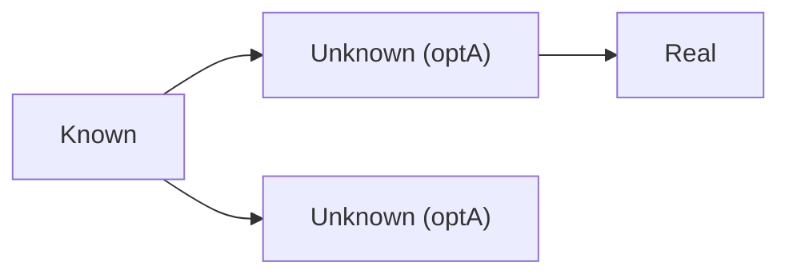
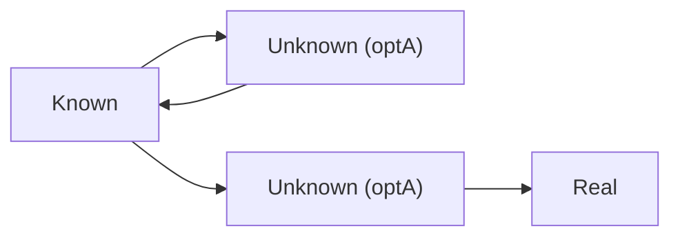

# NixoScope

## Why This Tool Exists

I recently switched to the [dendritic design pattern with flake parts](https://github.com/Doc-Steve/dendritic-design-with-flake-parts) and needed a way to understand my module structure:

- **Which modules get imported from other modules?**
- **Which modules get declared in what files?**

Manually tracing these relationships through code was tedious and error-prone, so I built this tool to visualize the module dependency graph.

## How It Works

This tool leverages the new `.graph` output introduced in the Nixpkgs module system.
Thanks to [this merged PR](https://github.com/NixOS/nixpkgs/pull/403839), we can now obtain a JSON representing the tree of modules that took part in the evaluation of a configuration.

For more details, see the [announcement on NixOS Discourse](https://discourse.nixos.org/t/nixpkgs-module-system-config-modules-graph/67722).

## Installation

### Clone and run directly
```bash
git clone https://github.com/giomf/nixoscope
cd nixoscope
uv sync
source .venv/bin/activate
python -m nixoscope.nixoscope --help
```

### Install from nixpkgs
```bash
nix-shell -p nixoscope
# or with flakes
nix profile install nixpkgs#nixoscope
```

### Run without installing
```bash
nix run github:giomf/nixoscope -- --help
```

## Usage

### Obtaining the input graph:  
```bash
nix eval --json '.#nixosConfigurations.<your-config>.graph' > graph.json
```

### Read the input graph:
```bash
nixoscope --input graph.json
```
default: graph.json

### Output format:
#### Graphviz: 
```bash
nixoscope --format gv
```
default: gv
#### Mermaid: 
```bash
nixoscope --format mm
```
default: gv
#### JSON  
```bash
nixoscope --format json
```
default: gv

### Filter by option prefix
```bash
nixoscope --option "flake.modules"
```

### Write output to a file
```bash
nixoscope --output graph.gv
```
default: prints to stdout

## Simplifying the Graph

The raw module graph is huge and full of noise, so nixoscope simplifies it
before rendering.

### Unknown modules

Some modules come from anonymous functions or list entries, so Nix can't
report a real file for them - they show up as `<unknown-module>`. A single
one is harmless, but real configs produce long, uninformative chains of them:


nixoscope collapses a run of unknown modules with the same triggering option
into one node carrying a count:


### Grouping

Unknown modules with the *same option* also get merged when they'd
otherwise be redundant: several unknown modules leading to the exact same
destination become one, and one leading nowhere (a dead end) merges into a
sibling that *does* have a destination, since the dead end adds nothing the
other doesn't already say. Note both unknown modules below share the same
option (`optA`) - that's what makes them mergeable in the first place.




Two unknown modules that genuinely lead to *different* destinations are
never merged - that difference is real information.

### Recursion

Some Nix module types are genuinely recursive (e.g. a host that can itself
provide another host). This shows up as an unknown module that imports
straight back to where it came from, alongside a sibling *for the same
option* that does lead somewhere real:



The self-loop is merged into the real-destination sibling instead of
staying as a separate dead end, and the recursion is kept as a two-way
edge on the merged node:


## Result

### Filtered by "flake.modules"


## Disclaimer
This project uses AI as an aid.
