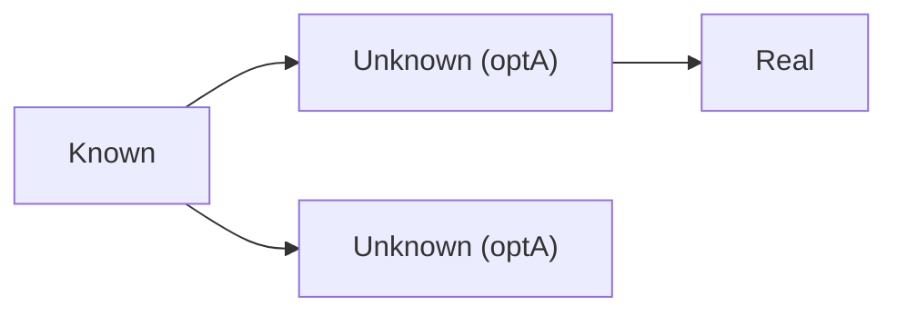
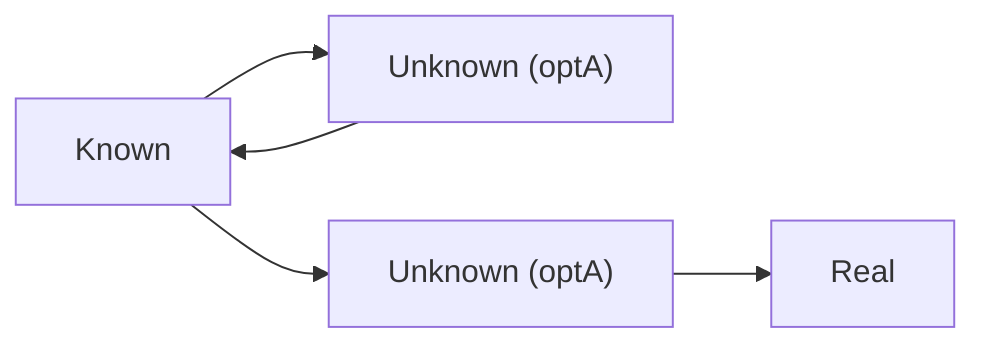

# NixoScope

## Why This Tool Exists

I recently switched to the [dendritic design pattern with flake parts](https://github.com/Doc-Steve/dendritic-design-with-flake-parts) and needed a way to understand my module structure:

- **Which modules get imported from other modules?**
- **Which modules get declared in what files?**

Manually tracing these relationships through code was tedious and error-prone, so I built this tool to visualize the module dependency graph.

## How It Works

This tool leverages the new `.graph` output introduced in the Nixpkgs module system.
Thanks to [this merged PR](https://github.com/NixOS/nixpkgs/pull/403839), we can now obtain a JSON representing the tree of modules that took part in the evaluation of a configuration.

For more details, see the [announcement on NixOS Discourse](https://discourse.nixos.org/t/nixpkgs-module-system-config-modules-graph/67722).

## Installation

### Clone and run directly
```bash
git clone https://github.com/giomf/nixoscope
cd nixoscope
uv sync
source .venv/bin/activate
python -m nixoscope.nixoscope --help
```

### Install from nixpkgs
```bash
nix-shell -p nixoscope
# or with flakes
nix profile install nixpkgs#nixoscope
```

### Run without installing
```bash
nix run github:giomf/nixoscope -- --help
```

## Usage

### Obtaining the input graph:  
```bash
nix eval --json '.#nixosConfigurations.<your-config>.graph' > graph.json
```

### Read the input graph:
```bash
nixoscope --input graph.json
```
default: graph.json

### Output format:
#### Graphviz: 
```bash
nixoscope --format gv
```
default: gv
#### Mermaid: 
```bash
nixoscope --format mm
```
default: gv
#### JSON  
```bash
nixoscope --format json
```
default: gv

### Filter by option prefix
```bash
nixoscope --option "flake.modules"
```

### Write output to a file
```bash
nixoscope --output graph.gv
```
default: prints to stdout

## Simplifying the Graph

The raw module graph is huge and full of noise, so nixoscope simplifies it
before rendering.

### Unknown modules

Some modules come from anonymous functions or list entries, so Nix can't
report a real file for them - they show up as `<unknown-module>`. A single
one is harmless, but real configs produce long, uninformative chains of them:


nixoscope collapses a run of unknown modules with the same triggering option
into one node carrying a count:


### Grouping

Unknown modules with the *same option* also get merged when they'd
otherwise be redundant: several unknown modules leading to the exact same
destination become one, and one leading nowhere (a dead end) merges into a
sibling that *does* have a destination, since the dead end adds nothing the
other doesn't already say. Note both unknown modules below share the same
option (`optA`) - that's what makes them mergeable in the first place.




Two unknown modules that genuinely lead to *different* destinations are
never merged - that difference is real information.

### Recursion

Some Nix module types are genuinely recursive (e.g. a host that can itself
provide another host). This shows up as an unknown module that imports
straight back to where it came from, alongside a sibling *for the same
option* that does lead somewhere real:



The self-loop is merged into the real-destination sibling instead of
staying as a separate dead end, and the recursion is kept as a two-way
edge on the merged node:


## Result

```mermaid
---
title: ModuleGraph
---
flowchart TD
	classDef src_rpix0rvfam7x57dcqrw1zalxscjxm1qm fill:#bcb2e5,color:#000000
	classDef src_7icp9601511yjcl1x2nqrx7id4z10vkz fill:#b2bce5,color:#000000
	classDef src_9qychlk3dhfawpiwf88ic7d2rcv3jjlw fill:#cdb2e5,color:#000000
	classDef src_xyc2w7jdmk4fxllad6jzxmshjc244yrr fill:#b6e5b2,color:#000000
	classDef src_w2jcgb8c6yph72nsksa6zmc8qdna8ys4 fill:#e5b3b2,color:#000000
	n_w2jcgb8c6yph72nsksa6zmc8qdna8ys4_flake.nix["<b>flake.nix</b><br/><i>w2jcgb8c6yph72nsksa6zmc8qdna8ys4</i>"]
n_w2jcgb8c6yph72nsksa6zmc8qdna8ys4_flake.nix:::src_w2jcgb8c6yph72nsksa6zmc8qdna8ys4
	n_xyc2w7jdmk4fxllad6jzxmshjc244yrr_flake.nix_modules.nixos.glap["<b>flake.nix#modules.nixos.glap</b><br/><i>xyc2w7jdmk4fxllad6jzxmshjc244yrr</i>"]
n_xyc2w7jdmk4fxllad6jzxmshjc244yrr_flake.nix_modules.nixos.glap:::src_xyc2w7jdmk4fxllad6jzxmshjc244yrr
	n_xyc2w7jdmk4fxllad6jzxmshjc244yrr_hosts_fw13_configuration.nix["<b>hosts/fw13/configuration.nix</b><br/>flake.modules.nixos.glap<br/><i>xyc2w7jdmk4fxllad6jzxmshjc244yrr</i>"]
n_xyc2w7jdmk4fxllad6jzxmshjc244yrr_hosts_fw13_configuration.nix:::src_xyc2w7jdmk4fxllad6jzxmshjc244yrr
	n_xyc2w7jdmk4fxllad6jzxmshjc244yrr_flake.nix_modules.nixos.guif["<b>flake.nix#modules.nixos.guif</b><br/><i>xyc2w7jdmk4fxllad6jzxmshjc244yrr</i>"]
n_xyc2w7jdmk4fxllad6jzxmshjc244yrr_flake.nix_modules.nixos.guif:::src_xyc2w7jdmk4fxllad6jzxmshjc244yrr
	n_xyc2w7jdmk4fxllad6jzxmshjc244yrr_modules_users_guif.nix["<b>modules/users/guif.nix</b><br/>flake.modules.nixos.guif<br/><i>xyc2w7jdmk4fxllad6jzxmshjc244yrr</i>"]
n_xyc2w7jdmk4fxllad6jzxmshjc244yrr_modules_users_guif.nix:::src_xyc2w7jdmk4fxllad6jzxmshjc244yrr
	n_xyc2w7jdmk4fxllad6jzxmshjc244yrr_flake.nix_modules.nixos.system-laptop["<b>flake.nix#modules.nixos.system-laptop</b><br/><i>xyc2w7jdmk4fxllad6jzxmshjc244yrr</i>"]
n_xyc2w7jdmk4fxllad6jzxmshjc244yrr_flake.nix_modules.nixos.system-laptop:::src_xyc2w7jdmk4fxllad6jzxmshjc244yrr
	n_xyc2w7jdmk4fxllad6jzxmshjc244yrr_modules_system_types_laptop.nix["<b>modules/system/types/laptop.nix</b><br/>flake.modules.nixos.system-laptop<br/><i>xyc2w7jdmk4fxllad6jzxmshjc244yrr</i>"]
n_xyc2w7jdmk4fxllad6jzxmshjc244yrr_modules_system_types_laptop.nix:::src_xyc2w7jdmk4fxllad6jzxmshjc244yrr
	n_xyc2w7jdmk4fxllad6jzxmshjc244yrr_flake.nix_modules.nixos.system-default["<b>flake.nix#modules.nixos.system-default</b><br/><i>xyc2w7jdmk4fxllad6jzxmshjc244yrr</i>"]
n_xyc2w7jdmk4fxllad6jzxmshjc244yrr_flake.nix_modules.nixos.system-default:::src_xyc2w7jdmk4fxllad6jzxmshjc244yrr
	n_xyc2w7jdmk4fxllad6jzxmshjc244yrr_modules_system_types_default.nix["<b>modules/system/types/default.nix</b><br/>flake.modules.nixos.system-default<br/><i>xyc2w7jdmk4fxllad6jzxmshjc244yrr</i>"]
n_xyc2w7jdmk4fxllad6jzxmshjc244yrr_modules_system_types_default.nix:::src_xyc2w7jdmk4fxllad6jzxmshjc244yrr
	n_xyc2w7jdmk4fxllad6jzxmshjc244yrr_flake.nix_modules.nixos.system-minimal["<b>flake.nix#modules.nixos.system-minimal</b><br/><i>xyc2w7jdmk4fxllad6jzxmshjc244yrr</i>"]
n_xyc2w7jdmk4fxllad6jzxmshjc244yrr_flake.nix_modules.nixos.system-minimal:::src_xyc2w7jdmk4fxllad6jzxmshjc244yrr
	n_xyc2w7jdmk4fxllad6jzxmshjc244yrr_modules_system_types_minimal.nix["<b>modules/system/types/minimal.nix</b><br/>flake.modules.nixos.system-minimal<br/><i>xyc2w7jdmk4fxllad6jzxmshjc244yrr</i>"]
n_xyc2w7jdmk4fxllad6jzxmshjc244yrr_modules_system_types_minimal.nix:::src_xyc2w7jdmk4fxllad6jzxmshjc244yrr
	n_xyc2w7jdmk4fxllad6jzxmshjc244yrr_flake.nix_modules.nixos.nix-settings["<b>flake.nix#modules.nixos.nix-settings</b><br/><i>xyc2w7jdmk4fxllad6jzxmshjc244yrr</i>"]
n_xyc2w7jdmk4fxllad6jzxmshjc244yrr_flake.nix_modules.nixos.nix-settings:::src_xyc2w7jdmk4fxllad6jzxmshjc244yrr
	n_xyc2w7jdmk4fxllad6jzxmshjc244yrr_modules_nix_settings.nix["<b>modules/nix/settings.nix</b><br/>flake.modules.nixos.nix-settings<br/><i>xyc2w7jdmk4fxllad6jzxmshjc244yrr</i>"]
n_xyc2w7jdmk4fxllad6jzxmshjc244yrr_modules_nix_settings.nix:::src_xyc2w7jdmk4fxllad6jzxmshjc244yrr
	n_xyc2w7jdmk4fxllad6jzxmshjc244yrr_flake.nix_modules.nixos.fonts["<b>flake.nix#modules.nixos.fonts</b><br/><i>xyc2w7jdmk4fxllad6jzxmshjc244yrr</i>"]
n_xyc2w7jdmk4fxllad6jzxmshjc244yrr_flake.nix_modules.nixos.fonts:::src_xyc2w7jdmk4fxllad6jzxmshjc244yrr
	n_xyc2w7jdmk4fxllad6jzxmshjc244yrr_modules_system_settings_font.nix["<b>modules/system/settings/font.nix</b><br/>flake.modules.nixos.fonts<br/><i>xyc2w7jdmk4fxllad6jzxmshjc244yrr</i>"]
n_xyc2w7jdmk4fxllad6jzxmshjc244yrr_modules_system_settings_font.nix:::src_xyc2w7jdmk4fxllad6jzxmshjc244yrr
	n_xyc2w7jdmk4fxllad6jzxmshjc244yrr_flake.nix_modules.nixos.home-manager["<b>flake.nix#modules.nixos.home-manager</b><br/><i>xyc2w7jdmk4fxllad6jzxmshjc244yrr</i>"]
n_xyc2w7jdmk4fxllad6jzxmshjc244yrr_flake.nix_modules.nixos.home-manager:::src_xyc2w7jdmk4fxllad6jzxmshjc244yrr
	n_xyc2w7jdmk4fxllad6jzxmshjc244yrr_modules_nix_home-manager.nix["<b>modules/nix/home-manager.nix</b><br/>flake.modules.nixos.home-manager<br/><i>xyc2w7jdmk4fxllad6jzxmshjc244yrr</i>"]
n_xyc2w7jdmk4fxllad6jzxmshjc244yrr_modules_nix_home-manager.nix:::src_xyc2w7jdmk4fxllad6jzxmshjc244yrr
	n_9qychlk3dhfawpiwf88ic7d2rcv3jjlw_nixos["<b>nixos</b><br/><i>9qychlk3dhfawpiwf88ic7d2rcv3jjlw</i>"]
n_9qychlk3dhfawpiwf88ic7d2rcv3jjlw_nixos:::src_9qychlk3dhfawpiwf88ic7d2rcv3jjlw
	n_9qychlk3dhfawpiwf88ic7d2rcv3jjlw_nixos_common.nix["<b>nixos/common.nix</b><br/><i>9qychlk3dhfawpiwf88ic7d2rcv3jjlw</i>"]
n_9qychlk3dhfawpiwf88ic7d2rcv3jjlw_nixos_common.nix:::src_9qychlk3dhfawpiwf88ic7d2rcv3jjlw
	n_xyc2w7jdmk4fxllad6jzxmshjc244yrr_flake.nix_modules.nixos.local["<b>flake.nix#modules.nixos.local</b><br/><i>xyc2w7jdmk4fxllad6jzxmshjc244yrr</i>"]
n_xyc2w7jdmk4fxllad6jzxmshjc244yrr_flake.nix_modules.nixos.local:::src_xyc2w7jdmk4fxllad6jzxmshjc244yrr
	n_xyc2w7jdmk4fxllad6jzxmshjc244yrr_modules_system_settings_local.nix["<b>modules/system/settings/local.nix</b><br/>flake.modules.nixos.local<br/><i>xyc2w7jdmk4fxllad6jzxmshjc244yrr</i>"]
n_xyc2w7jdmk4fxllad6jzxmshjc244yrr_modules_system_settings_local.nix:::src_xyc2w7jdmk4fxllad6jzxmshjc244yrr
	n_xyc2w7jdmk4fxllad6jzxmshjc244yrr_flake.nix_modules.nixos.cosmic["<b>flake.nix#modules.nixos.cosmic</b><br/><i>xyc2w7jdmk4fxllad6jzxmshjc244yrr</i>"]
n_xyc2w7jdmk4fxllad6jzxmshjc244yrr_flake.nix_modules.nixos.cosmic:::src_xyc2w7jdmk4fxllad6jzxmshjc244yrr
	n_xyc2w7jdmk4fxllad6jzxmshjc244yrr_modules_programs_wm_cosmic.nix["<b>modules/programs/wm/cosmic.nix</b><br/>flake.modules.nixos.cosmic<br/><i>xyc2w7jdmk4fxllad6jzxmshjc244yrr</i>"]
n_xyc2w7jdmk4fxllad6jzxmshjc244yrr_modules_programs_wm_cosmic.nix:::src_xyc2w7jdmk4fxllad6jzxmshjc244yrr
	n_xyc2w7jdmk4fxllad6jzxmshjc244yrr_flake.nix_modules.nixos.steam["<b>flake.nix#modules.nixos.steam</b><br/><i>xyc2w7jdmk4fxllad6jzxmshjc244yrr</i>"]
n_xyc2w7jdmk4fxllad6jzxmshjc244yrr_flake.nix_modules.nixos.steam:::src_xyc2w7jdmk4fxllad6jzxmshjc244yrr
	n_xyc2w7jdmk4fxllad6jzxmshjc244yrr_modules_programs_wm_steam.nix["<b>modules/programs/wm/steam.nix</b><br/>flake.modules.nixos.steam<br/><i>xyc2w7jdmk4fxllad6jzxmshjc244yrr</i>"]
n_xyc2w7jdmk4fxllad6jzxmshjc244yrr_modules_programs_wm_steam.nix:::src_xyc2w7jdmk4fxllad6jzxmshjc244yrr
	n_xyc2w7jdmk4fxllad6jzxmshjc244yrr_flake.nix_modules.nixos.templates["<b>flake.nix#modules.nixos.templates</b><br/><i>xyc2w7jdmk4fxllad6jzxmshjc244yrr</i>"]
n_xyc2w7jdmk4fxllad6jzxmshjc244yrr_flake.nix_modules.nixos.templates:::src_xyc2w7jdmk4fxllad6jzxmshjc244yrr
	n_xyc2w7jdmk4fxllad6jzxmshjc244yrr_modules_nix_templates.nix["<b>modules/nix/templates.nix</b><br/>flake.modules.nixos.templates<br/><i>xyc2w7jdmk4fxllad6jzxmshjc244yrr</i>"]
n_xyc2w7jdmk4fxllad6jzxmshjc244yrr_modules_nix_templates.nix:::src_xyc2w7jdmk4fxllad6jzxmshjc244yrr
	n_xyc2w7jdmk4fxllad6jzxmshjc244yrr_flake.nix_modules.nixos.systemd-boot["<b>flake.nix#modules.nixos.systemd-boot</b><br/><i>xyc2w7jdmk4fxllad6jzxmshjc244yrr</i>"]
n_xyc2w7jdmk4fxllad6jzxmshjc244yrr_flake.nix_modules.nixos.systemd-boot:::src_xyc2w7jdmk4fxllad6jzxmshjc244yrr
	n_xyc2w7jdmk4fxllad6jzxmshjc244yrr_modules_system_settings_systemd-boot.nix["<b>modules/system/settings/systemd-boot.nix</b><br/>flake.modules.nixos.systemd-boot<br/><i>xyc2w7jdmk4fxllad6jzxmshjc244yrr</i>"]
n_xyc2w7jdmk4fxllad6jzxmshjc244yrr_modules_system_settings_systemd-boot.nix:::src_xyc2w7jdmk4fxllad6jzxmshjc244yrr
	n_xyc2w7jdmk4fxllad6jzxmshjc244yrr_hosts_fw13_disko-config.nix["<b>hosts/fw13/disko-config.nix</b><br/>flake.modules.nixos.glap<br/><i>xyc2w7jdmk4fxllad6jzxmshjc244yrr</i>"]
n_xyc2w7jdmk4fxllad6jzxmshjc244yrr_hosts_fw13_disko-config.nix:::src_xyc2w7jdmk4fxllad6jzxmshjc244yrr
	n_xyc2w7jdmk4fxllad6jzxmshjc244yrr_hosts_fw13_guif.nix["<b>hosts/fw13/guif.nix</b><br/>flake.modules.nixos.glap<br/><i>xyc2w7jdmk4fxllad6jzxmshjc244yrr</i>"]
n_xyc2w7jdmk4fxllad6jzxmshjc244yrr_hosts_fw13_guif.nix:::src_xyc2w7jdmk4fxllad6jzxmshjc244yrr
	n_xyc2w7jdmk4fxllad6jzxmshjc244yrr_hosts_fw13_hardware.nix["<b>hosts/fw13/hardware.nix</b><br/>flake.modules.nixos.glap<br/><i>xyc2w7jdmk4fxllad6jzxmshjc244yrr</i>"]
n_xyc2w7jdmk4fxllad6jzxmshjc244yrr_hosts_fw13_hardware.nix:::src_xyc2w7jdmk4fxllad6jzxmshjc244yrr
	n_w2jcgb8c6yph72nsksa6zmc8qdna8ys4_nixos_modules_installer_scan_not-detected.nix["<b>nixos/modules/installer/scan/not-detected.nix</b><br/><i>w2jcgb8c6yph72nsksa6zmc8qdna8ys4</i>"]
n_w2jcgb8c6yph72nsksa6zmc8qdna8ys4_nixos_modules_installer_scan_not-detected.nix:::src_w2jcgb8c6yph72nsksa6zmc8qdna8ys4
	n_7icp9601511yjcl1x2nqrx7id4z10vkz_framework_13-inch_7040-amd["<b>framework/13-inch/7040-amd</b><br/><i>7icp9601511yjcl1x2nqrx7id4z10vkz</i>"]
n_7icp9601511yjcl1x2nqrx7id4z10vkz_framework_13-inch_7040-amd:::src_7icp9601511yjcl1x2nqrx7id4z10vkz
	n_7icp9601511yjcl1x2nqrx7id4z10vkz_framework_13-inch_common["<b>framework/13-inch/common</b><br/><i>7icp9601511yjcl1x2nqrx7id4z10vkz</i>"]
n_7icp9601511yjcl1x2nqrx7id4z10vkz_framework_13-inch_common:::src_7icp9601511yjcl1x2nqrx7id4z10vkz
	n_7icp9601511yjcl1x2nqrx7id4z10vkz_common_pc_laptop["<b>common/pc/laptop</b><br/><i>7icp9601511yjcl1x2nqrx7id4z10vkz</i>"]
n_7icp9601511yjcl1x2nqrx7id4z10vkz_common_pc_laptop:::src_7icp9601511yjcl1x2nqrx7id4z10vkz
	n_7icp9601511yjcl1x2nqrx7id4z10vkz_common_pc["<b>common/pc</b><br/><i>7icp9601511yjcl1x2nqrx7id4z10vkz</i>"]
n_7icp9601511yjcl1x2nqrx7id4z10vkz_common_pc:::src_7icp9601511yjcl1x2nqrx7id4z10vkz
	n_7icp9601511yjcl1x2nqrx7id4z10vkz_common_pc_ssd["<b>common/pc/ssd</b><br/><i>7icp9601511yjcl1x2nqrx7id4z10vkz</i>"]
n_7icp9601511yjcl1x2nqrx7id4z10vkz_common_pc_ssd:::src_7icp9601511yjcl1x2nqrx7id4z10vkz
	n_7icp9601511yjcl1x2nqrx7id4z10vkz_framework_bluetooth.nix["<b>framework/bluetooth.nix</b><br/><i>7icp9601511yjcl1x2nqrx7id4z10vkz</i>"]
n_7icp9601511yjcl1x2nqrx7id4z10vkz_framework_bluetooth.nix:::src_7icp9601511yjcl1x2nqrx7id4z10vkz
	n_7icp9601511yjcl1x2nqrx7id4z10vkz_framework_kmod.nix["<b>framework/kmod.nix</b><br/><i>7icp9601511yjcl1x2nqrx7id4z10vkz</i>"]
n_7icp9601511yjcl1x2nqrx7id4z10vkz_framework_kmod.nix:::src_7icp9601511yjcl1x2nqrx7id4z10vkz
	n_7icp9601511yjcl1x2nqrx7id4z10vkz_framework_framework-tool.nix["<b>framework/framework-tool.nix</b><br/><i>7icp9601511yjcl1x2nqrx7id4z10vkz</i>"]
n_7icp9601511yjcl1x2nqrx7id4z10vkz_framework_framework-tool.nix:::src_7icp9601511yjcl1x2nqrx7id4z10vkz
	n_7icp9601511yjcl1x2nqrx7id4z10vkz_framework_13-inch_common_audio.nix["<b>framework/13-inch/common/audio.nix</b><br/><i>7icp9601511yjcl1x2nqrx7id4z10vkz</i>"]
n_7icp9601511yjcl1x2nqrx7id4z10vkz_framework_13-inch_common_audio.nix:::src_7icp9601511yjcl1x2nqrx7id4z10vkz
	n_7icp9601511yjcl1x2nqrx7id4z10vkz_framework_13-inch_common_amd.nix["<b>framework/13-inch/common/amd.nix</b><br/><i>7icp9601511yjcl1x2nqrx7id4z10vkz</i>"]
n_7icp9601511yjcl1x2nqrx7id4z10vkz_framework_13-inch_common_amd.nix:::src_7icp9601511yjcl1x2nqrx7id4z10vkz
	n_7icp9601511yjcl1x2nqrx7id4z10vkz_common_cpu_amd["<b>common/cpu/amd</b><br/><i>7icp9601511yjcl1x2nqrx7id4z10vkz</i>"]
n_7icp9601511yjcl1x2nqrx7id4z10vkz_common_cpu_amd:::src_7icp9601511yjcl1x2nqrx7id4z10vkz
	n_7icp9601511yjcl1x2nqrx7id4z10vkz_common_cpu_amd_pstate.nix["<b>common/cpu/amd/pstate.nix</b><br/><i>7icp9601511yjcl1x2nqrx7id4z10vkz</i>"]
n_7icp9601511yjcl1x2nqrx7id4z10vkz_common_cpu_amd_pstate.nix:::src_7icp9601511yjcl1x2nqrx7id4z10vkz
	n_7icp9601511yjcl1x2nqrx7id4z10vkz_common_gpu_amd["<b>common/gpu/amd</b><br/><i>7icp9601511yjcl1x2nqrx7id4z10vkz</i>"]
n_7icp9601511yjcl1x2nqrx7id4z10vkz_common_gpu_amd:::src_7icp9601511yjcl1x2nqrx7id4z10vkz
	n_7icp9601511yjcl1x2nqrx7id4z10vkz_common_cpu_amd_raphael_igpu.nix["<b>common/cpu/amd/raphael/igpu.nix</b><br/><i>7icp9601511yjcl1x2nqrx7id4z10vkz</i>"]
n_7icp9601511yjcl1x2nqrx7id4z10vkz_common_cpu_amd_raphael_igpu.nix:::src_7icp9601511yjcl1x2nqrx7id4z10vkz
	n_rpix0rvfam7x57dcqrw1zalxscjxm1qm_module.nix["<b>module.nix</b><br/><i>rpix0rvfam7x57dcqrw1zalxscjxm1qm</i>"]
n_rpix0rvfam7x57dcqrw1zalxscjxm1qm_module.nix:::src_rpix0rvfam7x57dcqrw1zalxscjxm1qm
	n_rpix0rvfam7x57dcqrw1zalxscjxm1qm_lib_make-disk-image.nix["<b>lib/make-disk-image.nix</b><br/><i>rpix0rvfam7x57dcqrw1zalxscjxm1qm</i>"]
n_rpix0rvfam7x57dcqrw1zalxscjxm1qm_lib_make-disk-image.nix:::src_rpix0rvfam7x57dcqrw1zalxscjxm1qm
	n_w2jcgb8c6yph72nsksa6zmc8qdna8ys4_flake.nix --> n_xyc2w7jdmk4fxllad6jzxmshjc244yrr_flake.nix_modules.nixos.glap
	n_w2jcgb8c6yph72nsksa6zmc8qdna8ys4_flake.nix --> n_7icp9601511yjcl1x2nqrx7id4z10vkz_framework_13-inch_7040-amd
	n_w2jcgb8c6yph72nsksa6zmc8qdna8ys4_flake.nix --> n_rpix0rvfam7x57dcqrw1zalxscjxm1qm_module.nix
	n_xyc2w7jdmk4fxllad6jzxmshjc244yrr_flake.nix_modules.nixos.glap --> n_xyc2w7jdmk4fxllad6jzxmshjc244yrr_hosts_fw13_configuration.nix
	n_xyc2w7jdmk4fxllad6jzxmshjc244yrr_flake.nix_modules.nixos.glap --> n_xyc2w7jdmk4fxllad6jzxmshjc244yrr_hosts_fw13_disko-config.nix
	n_xyc2w7jdmk4fxllad6jzxmshjc244yrr_flake.nix_modules.nixos.glap --> n_xyc2w7jdmk4fxllad6jzxmshjc244yrr_hosts_fw13_guif.nix
	n_xyc2w7jdmk4fxllad6jzxmshjc244yrr_flake.nix_modules.nixos.glap --> n_xyc2w7jdmk4fxllad6jzxmshjc244yrr_hosts_fw13_hardware.nix
	n_xyc2w7jdmk4fxllad6jzxmshjc244yrr_hosts_fw13_configuration.nix --> n_xyc2w7jdmk4fxllad6jzxmshjc244yrr_flake.nix_modules.nixos.guif
	n_xyc2w7jdmk4fxllad6jzxmshjc244yrr_hosts_fw13_configuration.nix --> n_xyc2w7jdmk4fxllad6jzxmshjc244yrr_flake.nix_modules.nixos.system-laptop
	n_xyc2w7jdmk4fxllad6jzxmshjc244yrr_hosts_fw13_configuration.nix --> n_xyc2w7jdmk4fxllad6jzxmshjc244yrr_flake.nix_modules.nixos.systemd-boot
	n_xyc2w7jdmk4fxllad6jzxmshjc244yrr_flake.nix_modules.nixos.guif --> n_xyc2w7jdmk4fxllad6jzxmshjc244yrr_modules_users_guif.nix
	n_xyc2w7jdmk4fxllad6jzxmshjc244yrr_flake.nix_modules.nixos.system-laptop --> n_xyc2w7jdmk4fxllad6jzxmshjc244yrr_modules_system_types_laptop.nix
	n_xyc2w7jdmk4fxllad6jzxmshjc244yrr_modules_system_types_laptop.nix --> n_xyc2w7jdmk4fxllad6jzxmshjc244yrr_flake.nix_modules.nixos.system-default
	n_xyc2w7jdmk4fxllad6jzxmshjc244yrr_modules_system_types_laptop.nix --> n_xyc2w7jdmk4fxllad6jzxmshjc244yrr_flake.nix_modules.nixos.cosmic
	n_xyc2w7jdmk4fxllad6jzxmshjc244yrr_modules_system_types_laptop.nix --> n_xyc2w7jdmk4fxllad6jzxmshjc244yrr_flake.nix_modules.nixos.steam
	n_xyc2w7jdmk4fxllad6jzxmshjc244yrr_modules_system_types_laptop.nix --> n_xyc2w7jdmk4fxllad6jzxmshjc244yrr_flake.nix_modules.nixos.templates
	n_xyc2w7jdmk4fxllad6jzxmshjc244yrr_flake.nix_modules.nixos.system-default --> n_xyc2w7jdmk4fxllad6jzxmshjc244yrr_modules_system_types_default.nix
	n_xyc2w7jdmk4fxllad6jzxmshjc244yrr_modules_system_types_default.nix --> n_xyc2w7jdmk4fxllad6jzxmshjc244yrr_flake.nix_modules.nixos.system-minimal
	n_xyc2w7jdmk4fxllad6jzxmshjc244yrr_modules_system_types_default.nix --> n_xyc2w7jdmk4fxllad6jzxmshjc244yrr_flake.nix_modules.nixos.fonts
	n_xyc2w7jdmk4fxllad6jzxmshjc244yrr_modules_system_types_default.nix --> n_xyc2w7jdmk4fxllad6jzxmshjc244yrr_flake.nix_modules.nixos.home-manager
	n_xyc2w7jdmk4fxllad6jzxmshjc244yrr_modules_system_types_default.nix --> n_xyc2w7jdmk4fxllad6jzxmshjc244yrr_flake.nix_modules.nixos.local
	n_xyc2w7jdmk4fxllad6jzxmshjc244yrr_flake.nix_modules.nixos.system-minimal --> n_xyc2w7jdmk4fxllad6jzxmshjc244yrr_modules_system_types_minimal.nix
	n_xyc2w7jdmk4fxllad6jzxmshjc244yrr_modules_system_types_minimal.nix --> n_xyc2w7jdmk4fxllad6jzxmshjc244yrr_flake.nix_modules.nixos.nix-settings
	n_xyc2w7jdmk4fxllad6jzxmshjc244yrr_flake.nix_modules.nixos.nix-settings --> n_xyc2w7jdmk4fxllad6jzxmshjc244yrr_modules_nix_settings.nix
	n_xyc2w7jdmk4fxllad6jzxmshjc244yrr_flake.nix_modules.nixos.fonts --> n_xyc2w7jdmk4fxllad6jzxmshjc244yrr_modules_system_settings_font.nix
	n_xyc2w7jdmk4fxllad6jzxmshjc244yrr_flake.nix_modules.nixos.home-manager --> n_xyc2w7jdmk4fxllad6jzxmshjc244yrr_modules_nix_home-manager.nix
	n_xyc2w7jdmk4fxllad6jzxmshjc244yrr_modules_nix_home-manager.nix --> n_9qychlk3dhfawpiwf88ic7d2rcv3jjlw_nixos
	n_9qychlk3dhfawpiwf88ic7d2rcv3jjlw_nixos --> n_9qychlk3dhfawpiwf88ic7d2rcv3jjlw_nixos_common.nix
	n_xyc2w7jdmk4fxllad6jzxmshjc244yrr_flake.nix_modules.nixos.local --> n_xyc2w7jdmk4fxllad6jzxmshjc244yrr_modules_system_settings_local.nix
	n_xyc2w7jdmk4fxllad6jzxmshjc244yrr_flake.nix_modules.nixos.cosmic --> n_xyc2w7jdmk4fxllad6jzxmshjc244yrr_modules_programs_wm_cosmic.nix
	n_xyc2w7jdmk4fxllad6jzxmshjc244yrr_flake.nix_modules.nixos.steam --> n_xyc2w7jdmk4fxllad6jzxmshjc244yrr_modules_programs_wm_steam.nix
	n_xyc2w7jdmk4fxllad6jzxmshjc244yrr_flake.nix_modules.nixos.templates --> n_xyc2w7jdmk4fxllad6jzxmshjc244yrr_modules_nix_templates.nix
	n_xyc2w7jdmk4fxllad6jzxmshjc244yrr_flake.nix_modules.nixos.systemd-boot --> n_xyc2w7jdmk4fxllad6jzxmshjc244yrr_modules_system_settings_systemd-boot.nix
	n_xyc2w7jdmk4fxllad6jzxmshjc244yrr_hosts_fw13_hardware.nix --> n_w2jcgb8c6yph72nsksa6zmc8qdna8ys4_nixos_modules_installer_scan_not-detected.nix
	n_7icp9601511yjcl1x2nqrx7id4z10vkz_framework_13-inch_7040-amd --> n_7icp9601511yjcl1x2nqrx7id4z10vkz_framework_13-inch_common
	n_7icp9601511yjcl1x2nqrx7id4z10vkz_framework_13-inch_7040-amd --> n_7icp9601511yjcl1x2nqrx7id4z10vkz_framework_13-inch_common_amd.nix
	n_7icp9601511yjcl1x2nqrx7id4z10vkz_framework_13-inch_7040-amd --> n_7icp9601511yjcl1x2nqrx7id4z10vkz_common_cpu_amd_raphael_igpu.nix
	n_7icp9601511yjcl1x2nqrx7id4z10vkz_framework_13-inch_common --> n_7icp9601511yjcl1x2nqrx7id4z10vkz_common_pc_laptop
	n_7icp9601511yjcl1x2nqrx7id4z10vkz_framework_13-inch_common --> n_7icp9601511yjcl1x2nqrx7id4z10vkz_common_pc_ssd
	n_7icp9601511yjcl1x2nqrx7id4z10vkz_framework_13-inch_common --> n_7icp9601511yjcl1x2nqrx7id4z10vkz_framework_bluetooth.nix
	n_7icp9601511yjcl1x2nqrx7id4z10vkz_framework_13-inch_common --> n_7icp9601511yjcl1x2nqrx7id4z10vkz_framework_kmod.nix
	n_7icp9601511yjcl1x2nqrx7id4z10vkz_framework_13-inch_common --> n_7icp9601511yjcl1x2nqrx7id4z10vkz_framework_framework-tool.nix
	n_7icp9601511yjcl1x2nqrx7id4z10vkz_framework_13-inch_common --> n_7icp9601511yjcl1x2nqrx7id4z10vkz_framework_13-inch_common_audio.nix
	n_7icp9601511yjcl1x2nqrx7id4z10vkz_common_pc_laptop --> n_7icp9601511yjcl1x2nqrx7id4z10vkz_common_pc
	n_7icp9601511yjcl1x2nqrx7id4z10vkz_framework_13-inch_common_amd.nix --> n_7icp9601511yjcl1x2nqrx7id4z10vkz_common_cpu_amd
	n_7icp9601511yjcl1x2nqrx7id4z10vkz_framework_13-inch_common_amd.nix --> n_7icp9601511yjcl1x2nqrx7id4z10vkz_common_cpu_amd_pstate.nix
	n_7icp9601511yjcl1x2nqrx7id4z10vkz_framework_13-inch_common_amd.nix --> n_7icp9601511yjcl1x2nqrx7id4z10vkz_common_gpu_amd
	n_7icp9601511yjcl1x2nqrx7id4z10vkz_common_cpu_amd_pstate.nix --> n_7icp9601511yjcl1x2nqrx7id4z10vkz_common_cpu_amd
	n_7icp9601511yjcl1x2nqrx7id4z10vkz_common_cpu_amd_raphael_igpu.nix --> n_7icp9601511yjcl1x2nqrx7id4z10vkz_common_cpu_amd
	n_rpix0rvfam7x57dcqrw1zalxscjxm1qm_module.nix --> n_rpix0rvfam7x57dcqrw1zalxscjxm1qm_lib_make-disk-image.nix
```

### Filtered by "flake.modules"

```mermaid
---
title: ModuleGraph
---
flowchart TD
	classDef src_xyc2w7jdmk4fxllad6jzxmshjc244yrr fill:#b6e5b2,color:#000000
	classDef src_w2jcgb8c6yph72nsksa6zmc8qdna8ys4 fill:#e5b3b2,color:#000000
	n_w2jcgb8c6yph72nsksa6zmc8qdna8ys4_flake.nix["<b>flake.nix</b><br/><i>w2jcgb8c6yph72nsksa6zmc8qdna8ys4</i>"]
n_w2jcgb8c6yph72nsksa6zmc8qdna8ys4_flake.nix:::src_w2jcgb8c6yph72nsksa6zmc8qdna8ys4
	n_xyc2w7jdmk4fxllad6jzxmshjc244yrr_hosts_fw13_configuration.nix["<b>hosts/fw13/configuration.nix</b><br/>flake.modules.nixos.glap<br/><i>xyc2w7jdmk4fxllad6jzxmshjc244yrr</i>"]
n_xyc2w7jdmk4fxllad6jzxmshjc244yrr_hosts_fw13_configuration.nix:::src_xyc2w7jdmk4fxllad6jzxmshjc244yrr
	n_xyc2w7jdmk4fxllad6jzxmshjc244yrr_modules_users_guif.nix["<b>modules/users/guif.nix</b><br/>flake.modules.nixos.guif<br/><i>xyc2w7jdmk4fxllad6jzxmshjc244yrr</i>"]
n_xyc2w7jdmk4fxllad6jzxmshjc244yrr_modules_users_guif.nix:::src_xyc2w7jdmk4fxllad6jzxmshjc244yrr
	n_xyc2w7jdmk4fxllad6jzxmshjc244yrr_modules_system_types_laptop.nix["<b>modules/system/types/laptop.nix</b><br/>flake.modules.nixos.system-laptop<br/><i>xyc2w7jdmk4fxllad6jzxmshjc244yrr</i>"]
n_xyc2w7jdmk4fxllad6jzxmshjc244yrr_modules_system_types_laptop.nix:::src_xyc2w7jdmk4fxllad6jzxmshjc244yrr
	n_xyc2w7jdmk4fxllad6jzxmshjc244yrr_modules_system_types_default.nix["<b>modules/system/types/default.nix</b><br/>flake.modules.nixos.system-default<br/><i>xyc2w7jdmk4fxllad6jzxmshjc244yrr</i>"]
n_xyc2w7jdmk4fxllad6jzxmshjc244yrr_modules_system_types_default.nix:::src_xyc2w7jdmk4fxllad6jzxmshjc244yrr
	n_xyc2w7jdmk4fxllad6jzxmshjc244yrr_modules_system_types_minimal.nix["<b>modules/system/types/minimal.nix</b><br/>flake.modules.nixos.system-minimal<br/><i>xyc2w7jdmk4fxllad6jzxmshjc244yrr</i>"]
n_xyc2w7jdmk4fxllad6jzxmshjc244yrr_modules_system_types_minimal.nix:::src_xyc2w7jdmk4fxllad6jzxmshjc244yrr
	n_xyc2w7jdmk4fxllad6jzxmshjc244yrr_modules_nix_settings.nix["<b>modules/nix/settings.nix</b><br/>flake.modules.nixos.nix-settings<br/><i>xyc2w7jdmk4fxllad6jzxmshjc244yrr</i>"]
n_xyc2w7jdmk4fxllad6jzxmshjc244yrr_modules_nix_settings.nix:::src_xyc2w7jdmk4fxllad6jzxmshjc244yrr
	n_xyc2w7jdmk4fxllad6jzxmshjc244yrr_modules_system_settings_font.nix["<b>modules/system/settings/font.nix</b><br/>flake.modules.nixos.fonts<br/><i>xyc2w7jdmk4fxllad6jzxmshjc244yrr</i>"]
n_xyc2w7jdmk4fxllad6jzxmshjc244yrr_modules_system_settings_font.nix:::src_xyc2w7jdmk4fxllad6jzxmshjc244yrr
	n_xyc2w7jdmk4fxllad6jzxmshjc244yrr_modules_nix_home-manager.nix["<b>modules/nix/home-manager.nix</b><br/>flake.modules.nixos.home-manager<br/><i>xyc2w7jdmk4fxllad6jzxmshjc244yrr</i>"]
n_xyc2w7jdmk4fxllad6jzxmshjc244yrr_modules_nix_home-manager.nix:::src_xyc2w7jdmk4fxllad6jzxmshjc244yrr
	n_xyc2w7jdmk4fxllad6jzxmshjc244yrr_modules_system_settings_local.nix["<b>modules/system/settings/local.nix</b><br/>flake.modules.nixos.local<br/><i>xyc2w7jdmk4fxllad6jzxmshjc244yrr</i>"]
n_xyc2w7jdmk4fxllad6jzxmshjc244yrr_modules_system_settings_local.nix:::src_xyc2w7jdmk4fxllad6jzxmshjc244yrr
	n_xyc2w7jdmk4fxllad6jzxmshjc244yrr_modules_programs_wm_cosmic.nix["<b>modules/programs/wm/cosmic.nix</b><br/>flake.modules.nixos.cosmic<br/><i>xyc2w7jdmk4fxllad6jzxmshjc244yrr</i>"]
n_xyc2w7jdmk4fxllad6jzxmshjc244yrr_modules_programs_wm_cosmic.nix:::src_xyc2w7jdmk4fxllad6jzxmshjc244yrr
	n_xyc2w7jdmk4fxllad6jzxmshjc244yrr_modules_programs_wm_steam.nix["<b>modules/programs/wm/steam.nix</b><br/>flake.modules.nixos.steam<br/><i>xyc2w7jdmk4fxllad6jzxmshjc244yrr</i>"]
n_xyc2w7jdmk4fxllad6jzxmshjc244yrr_modules_programs_wm_steam.nix:::src_xyc2w7jdmk4fxllad6jzxmshjc244yrr
	n_xyc2w7jdmk4fxllad6jzxmshjc244yrr_modules_nix_templates.nix["<b>modules/nix/templates.nix</b><br/>flake.modules.nixos.templates<br/><i>xyc2w7jdmk4fxllad6jzxmshjc244yrr</i>"]
n_xyc2w7jdmk4fxllad6jzxmshjc244yrr_modules_nix_templates.nix:::src_xyc2w7jdmk4fxllad6jzxmshjc244yrr
	n_xyc2w7jdmk4fxllad6jzxmshjc244yrr_modules_system_settings_systemd-boot.nix["<b>modules/system/settings/systemd-boot.nix</b><br/>flake.modules.nixos.systemd-boot<br/><i>xyc2w7jdmk4fxllad6jzxmshjc244yrr</i>"]
n_xyc2w7jdmk4fxllad6jzxmshjc244yrr_modules_system_settings_systemd-boot.nix:::src_xyc2w7jdmk4fxllad6jzxmshjc244yrr
	n_xyc2w7jdmk4fxllad6jzxmshjc244yrr_hosts_fw13_disko-config.nix["<b>hosts/fw13/disko-config.nix</b><br/>flake.modules.nixos.glap<br/><i>xyc2w7jdmk4fxllad6jzxmshjc244yrr</i>"]
n_xyc2w7jdmk4fxllad6jzxmshjc244yrr_hosts_fw13_disko-config.nix:::src_xyc2w7jdmk4fxllad6jzxmshjc244yrr
	n_xyc2w7jdmk4fxllad6jzxmshjc244yrr_hosts_fw13_guif.nix["<b>hosts/fw13/guif.nix</b><br/>flake.modules.nixos.glap<br/><i>xyc2w7jdmk4fxllad6jzxmshjc244yrr</i>"]
n_xyc2w7jdmk4fxllad6jzxmshjc244yrr_hosts_fw13_guif.nix:::src_xyc2w7jdmk4fxllad6jzxmshjc244yrr
	n_xyc2w7jdmk4fxllad6jzxmshjc244yrr_hosts_fw13_hardware.nix["<b>hosts/fw13/hardware.nix</b><br/>flake.modules.nixos.glap<br/><i>xyc2w7jdmk4fxllad6jzxmshjc244yrr</i>"]
n_xyc2w7jdmk4fxllad6jzxmshjc244yrr_hosts_fw13_hardware.nix:::src_xyc2w7jdmk4fxllad6jzxmshjc244yrr
	n_w2jcgb8c6yph72nsksa6zmc8qdna8ys4_flake.nix --> n_xyc2w7jdmk4fxllad6jzxmshjc244yrr_hosts_fw13_configuration.nix
	n_w2jcgb8c6yph72nsksa6zmc8qdna8ys4_flake.nix --> n_xyc2w7jdmk4fxllad6jzxmshjc244yrr_hosts_fw13_disko-config.nix
	n_w2jcgb8c6yph72nsksa6zmc8qdna8ys4_flake.nix --> n_xyc2w7jdmk4fxllad6jzxmshjc244yrr_hosts_fw13_guif.nix
	n_w2jcgb8c6yph72nsksa6zmc8qdna8ys4_flake.nix --> n_xyc2w7jdmk4fxllad6jzxmshjc244yrr_hosts_fw13_hardware.nix
	n_xyc2w7jdmk4fxllad6jzxmshjc244yrr_hosts_fw13_configuration.nix --> n_xyc2w7jdmk4fxllad6jzxmshjc244yrr_modules_users_guif.nix
	n_xyc2w7jdmk4fxllad6jzxmshjc244yrr_hosts_fw13_configuration.nix --> n_xyc2w7jdmk4fxllad6jzxmshjc244yrr_modules_system_types_laptop.nix
	n_xyc2w7jdmk4fxllad6jzxmshjc244yrr_hosts_fw13_configuration.nix --> n_xyc2w7jdmk4fxllad6jzxmshjc244yrr_modules_system_settings_systemd-boot.nix
	n_xyc2w7jdmk4fxllad6jzxmshjc244yrr_modules_system_types_laptop.nix --> n_xyc2w7jdmk4fxllad6jzxmshjc244yrr_modules_system_types_default.nix
	n_xyc2w7jdmk4fxllad6jzxmshjc244yrr_modules_system_types_laptop.nix --> n_xyc2w7jdmk4fxllad6jzxmshjc244yrr_modules_programs_wm_cosmic.nix
	n_xyc2w7jdmk4fxllad6jzxmshjc244yrr_modules_system_types_laptop.nix --> n_xyc2w7jdmk4fxllad6jzxmshjc244yrr_modules_programs_wm_steam.nix
	n_xyc2w7jdmk4fxllad6jzxmshjc244yrr_modules_system_types_laptop.nix --> n_xyc2w7jdmk4fxllad6jzxmshjc244yrr_modules_nix_templates.nix
	n_xyc2w7jdmk4fxllad6jzxmshjc244yrr_modules_system_types_default.nix --> n_xyc2w7jdmk4fxllad6jzxmshjc244yrr_modules_system_types_minimal.nix
	n_xyc2w7jdmk4fxllad6jzxmshjc244yrr_modules_system_types_default.nix --> n_xyc2w7jdmk4fxllad6jzxmshjc244yrr_modules_system_settings_font.nix
	n_xyc2w7jdmk4fxllad6jzxmshjc244yrr_modules_system_types_default.nix --> n_xyc2w7jdmk4fxllad6jzxmshjc244yrr_modules_nix_home-manager.nix
	n_xyc2w7jdmk4fxllad6jzxmshjc244yrr_modules_system_types_default.nix --> n_xyc2w7jdmk4fxllad6jzxmshjc244yrr_modules_system_settings_local.nix
	n_xyc2w7jdmk4fxllad6jzxmshjc244yrr_modules_system_types_minimal.nix --> n_xyc2w7jdmk4fxllad6jzxmshjc244yrr_modules_nix_settings.nix
```



## Disclaimer
This project uses AI as an aid.
